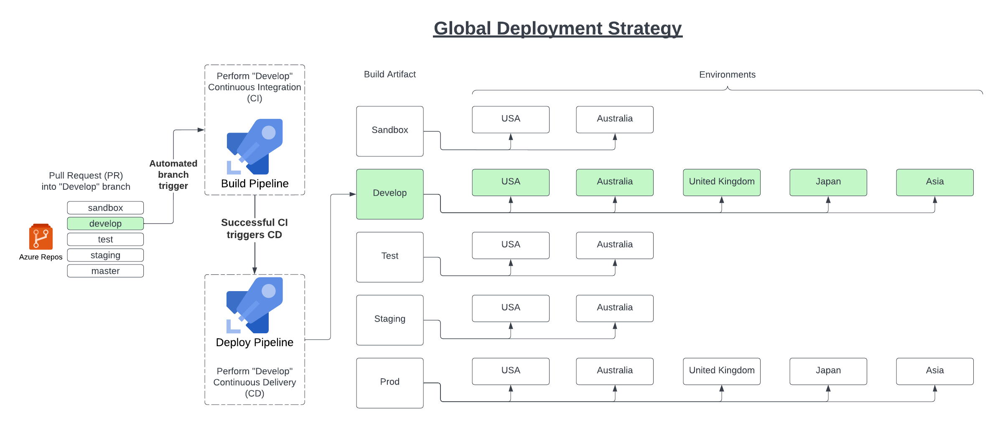
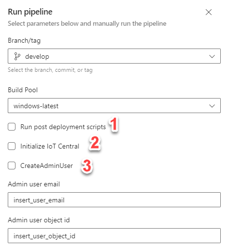

# Callisto Platform 
This repository constitutes the backbone of IoT Central and related services for the Callisto initiative

### Branching strategy
Order of tiers:
- Sandbox (0)
- Develop (1)
- Test (2)
- Staging (3)
- Prod (4)

1. All new changes should be merged into Sandbox (0) first via Pull Request (PR)
2. Changes will be brought up through the tiers by PR:  
   1. e.g. to get new work into `Test` we must begin with:
      1. PR `feature` branch to |--> `Sandbox`
         1. (only one approval required, can be creator of PR)
      2. PR `Sandbox` to |-->  `Develop`
         1. (two approvals required, creator plus another is sufficient)
      3. PR `Develop` to |--> `Test`
         1. (two approvals required)
   2. Example deployment to `Develop` branch to all associated environments :
)

## Initializing environments
 _**N.B.**_ *Both the below steps require "Run post deployment scripts" toggle to be enabled to run successfully.* (1)  
 )
### Initialize IoT Central
The post-deployment steps have cli scripts to auto-initialize a fresh environment.  In short this creates the export destination and data exports for such IoTC instance, should they not exist, and can be enabled by choosing "Initialize IoT Central" option from the manual pipeline option. (2)

### Create an Admin User
An admin user will need created for each new IoTC instance instantiated.  
By manually running the pipeline for the required environment(s) an admin user can be created by providing the user's email and objectId from NASA's Azure AD for said user to be created. (3)
