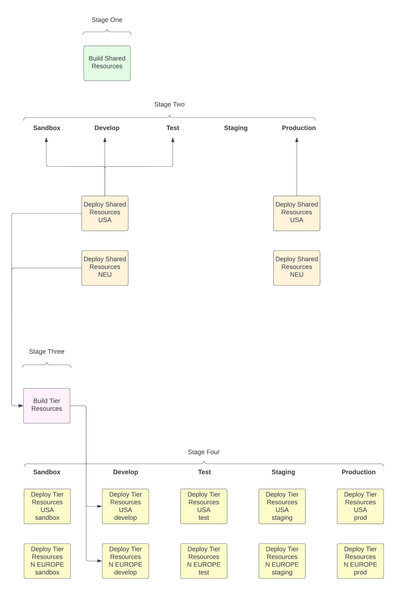
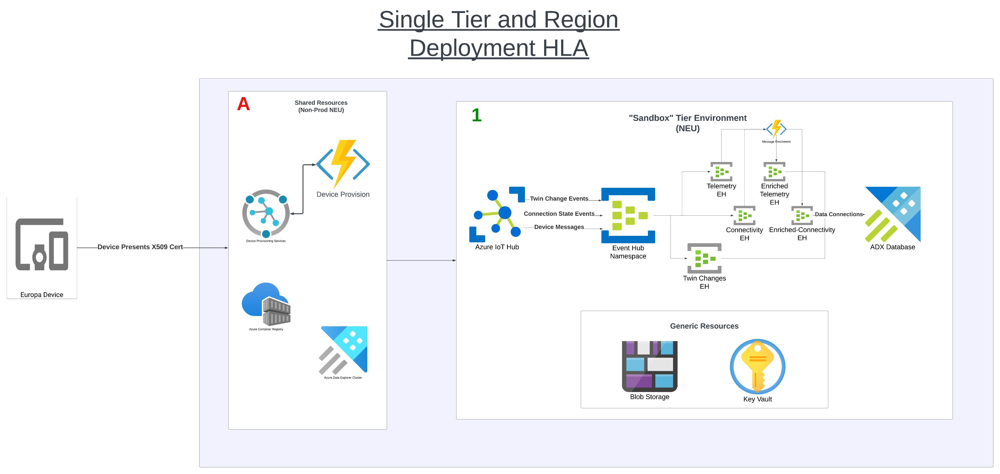
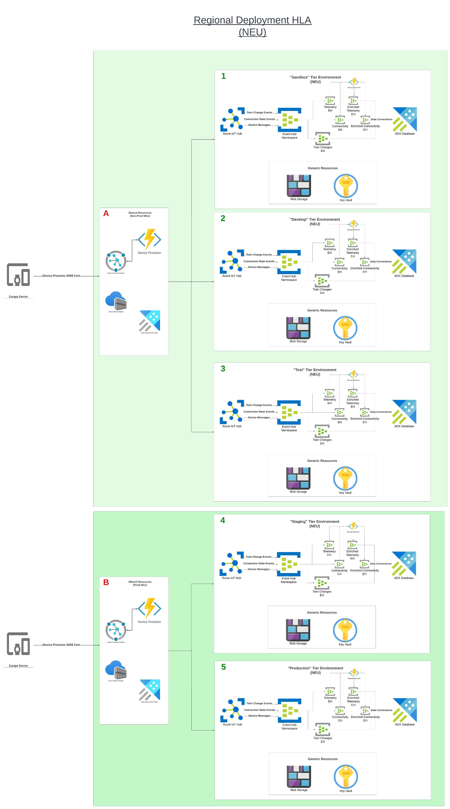
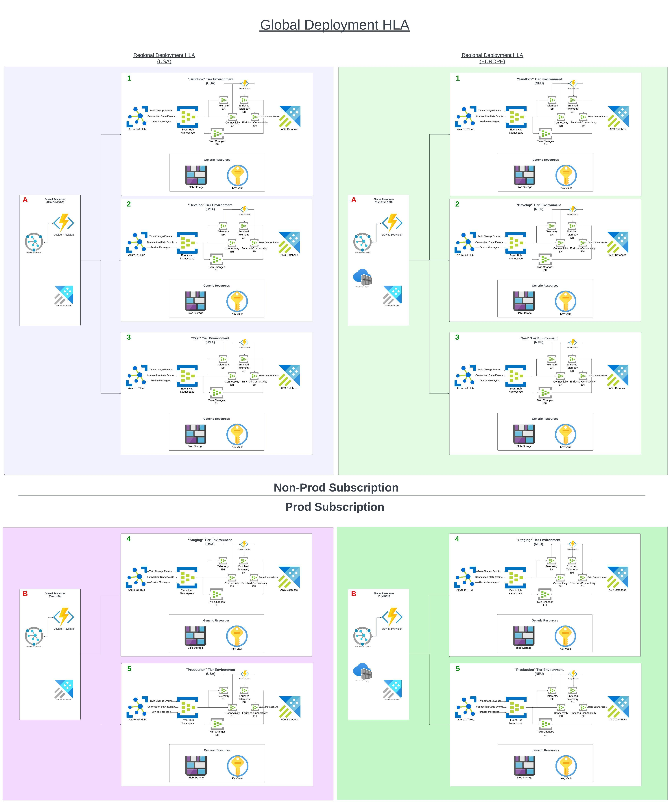

# Callisto Platform

This repository constitutes the backbone of IoT Hub and related services for the Callisto initiative

### Branching strategy

Order of tiers:

- Sandbox (0)
- Develop (1)
- Test (2)
- Staging (3)
- Prod (4)

1. All new changes should be merged into Sandbox (0) first
   1. N.B. only "principal" branches (`sandbox`, `develop`, `test`, `staging`, `master`) are eligible deployment targets. Any other branch will fail branch policies and deployment of infrastructure will be skipped. Useful for running a build, useless when trying to get a fix out.
2. Changes will be brought up through the tiers by PR:  
   1. e.g. to get new work into `Test` we must begin with:
      1. PR `feature` branch to |--> `Sandbox`
         1. (only one approval required, can be creator of PR)
         2. We can also merge directly into `sandbox` should only one developer be maintaining this repo. PR is a formality at this stage but not condusive to POC work. Begin PR with going into `develop`.
            1. Recommend a `squash` merge into `develop`! Otherwise all the commits will clutter the branch during testing.
      2. PR `Sandbox` to |--> `Develop`
         1. (two approvals required, creator plus another is sufficient)
      3. PR `Develop` to |--> `Test`
         1. (two approvals required)
   2. Example deployment to `Develop` branch to all associated environments :
      )

## Shared and Tier Resources

To reduce overhead and cost of resources there is a system of shared resources consisting of Azure Data Explorer, Azure Container Registry, and Azure Device Provisioning Services.

Simply put, each datacenter (e.g. USA) will have single instances of Non-Prod and Prod resources consisting of the above resources, as demonstrated in the following images:

# Creating a New Environment

1. Merge your code into the desired branch (assuming Sandbox as the first environment, but depends on your need).
2. Shared Resources should roll out without a hitch (sometimes ADX will hang and time out, but this is rare - just rerun pipeline to remedy).
   1. If this is the first time a deployment takes place in a brand-new environment where the resource groups have not been created, it is expected that the pipeline will fail due to "resource group not found." This is due to a poor dependency chain of Terraform attempting to deploy into a resource group that is not yet ready and is out of our control. After pipeline fails, wait a few minutes, and try again. If same error appears, rinse and repeat until pipeline succeeds. This will not happen after the first time the resource groups are created.'
3. Perform the next two steps before running the pipeline again.
   1. Next issue is when Data Connections on ADX are being established. Since the ADX database and Data Connections roll out together, the first time this process takes place the deployment will fail.
      1. Currently the process of establishing the ADX schemas is manual. Now is the time to apply those from the [empower-data-explorer repository.](https://github.com/NasaGroup/empower-data-explorer)
      2. N.B. the above may be remedied at a later time.
   2. The [Device Provision function app](https://github.com/NasaGroup/empower-function-device-provision) and [Message Enrichment function app](https://github.com/NasaGroup/empower-function-message-enrichment) are also in separate repositories. Run both of these repositories with the appropriate branches to deploy to the desired environment.
4. Now run the same pipeline as you did in step 1. "Run New" (rerun failed jobs -> does not work because TF will detect .tfplan is not latest and will end process preemptively)
5. Assuming everything above has been done you should have created a brand new and fully functional Callisto Platform environment!
